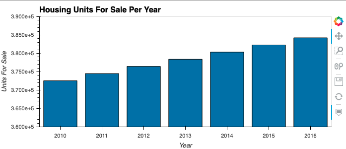
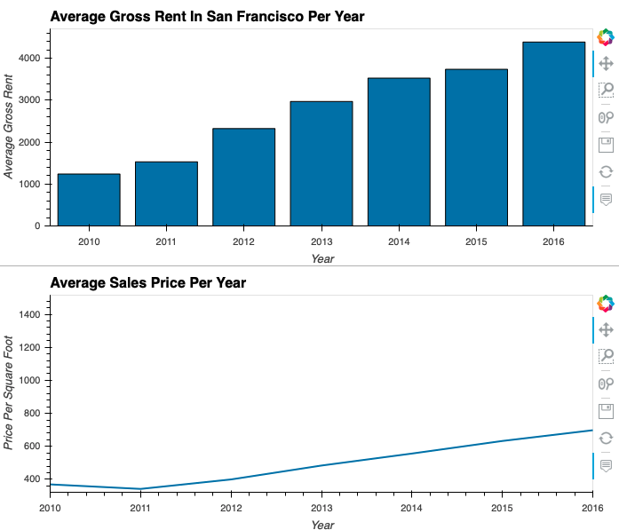
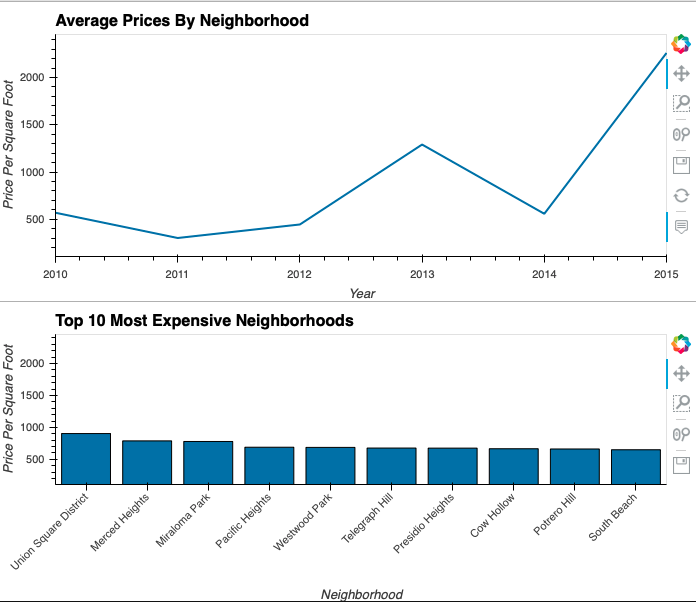
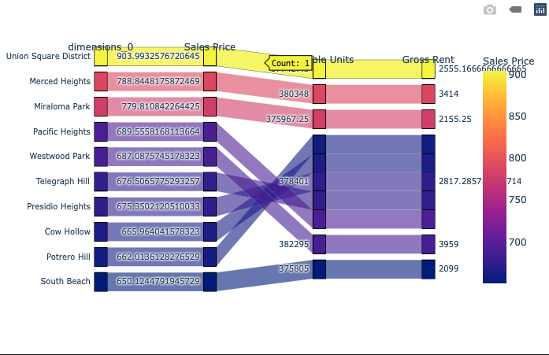
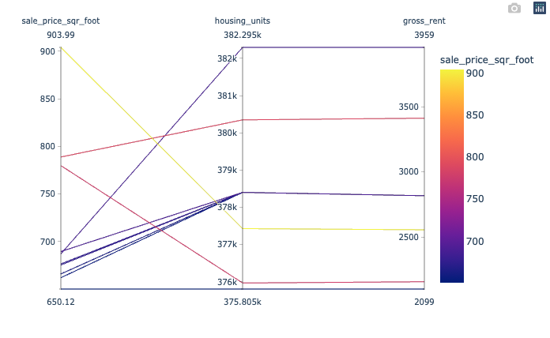
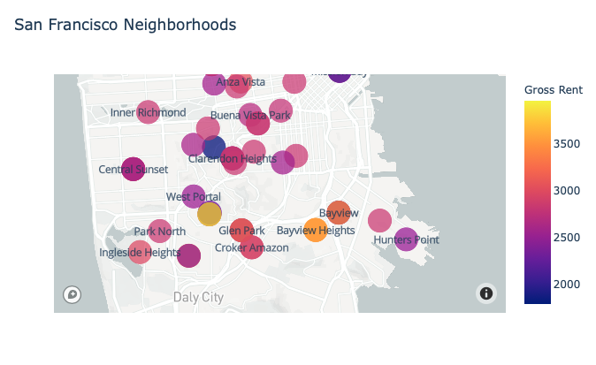

# SF Housing Rental Analysis Dashboard

## Housing Units

Overall, available housing units in San Francisco have gone up.  From 2010 to 
2016, housing units for sale increased from 372,560 to 384,242—a growth rate of 
3.1%.

## Rent and Sales Prices

Rent and sales prices have also experienced an upward trend.  Over 6 years 
beginning with 2010, gross rent increased from $1,239 to $4,390 in 2016.  Sales 
price per square foot declined slightly from 2010 to 2011 ($369 to $342), but 
steadily increased to just under $700 in 2016.

## Neighborhoods

The most expensive neighborhood, Union Square District, has an average price of 
$904 per square foot.  Union Square District, Merced Heights, and Miraloma Park 
all have average prices above $700.  In some cases, neighborhood prices have 
risen well above their average price.  For example, in 2015 Union Square’s 
price had exceeded $2,000. 

## Parallel Charts

These parallel charts give us a better idea of the relationship between a 
neighborhood’s sales price, rent price, and unit availability.  In general, the 
rent one could earn from a property does not necessarily correlate to a high 
sales price.  While Union Square district has the highest average sales price, 
its average gross rent is only $2,556.  From an investment standpoint, Pacific 
Heights may be a better neighborhood; its average sales price is $690, but its 
rent is much higher—almost $4,000.

## Map

San Francisco is one of the most expensive and highly sought after real estate 
areas in the country.  While there is not a noticeable difference in 
neighborhoods’ available units, we can see the location of the two 
neighborhoods with the highest rents: Miraloma Park and Excelsior.